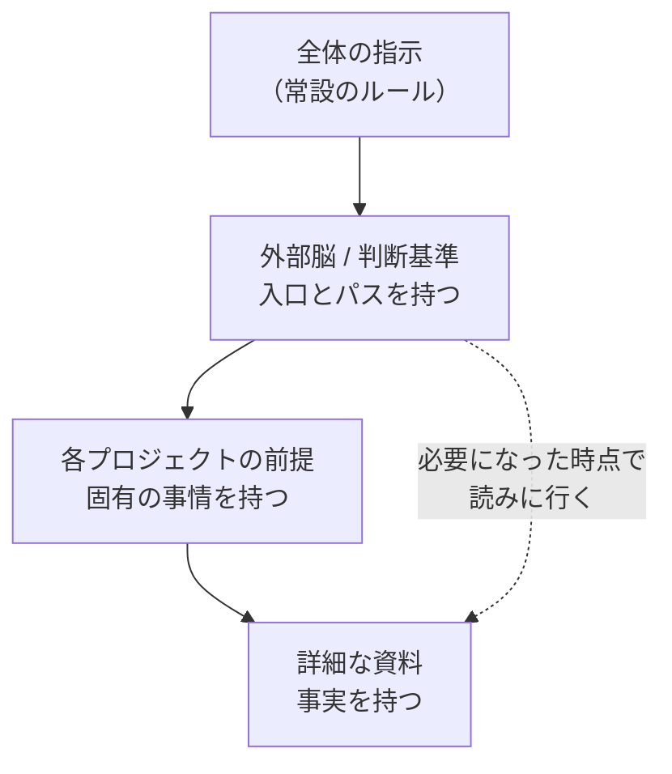

# 生成AIに前提を渡す — 個人での実験と、そこで分かったこと

私用の環境で、生成AIに自分の前提を渡す仕組みを作っています。この文書は、その**結果**をまとめたものです。

取り組みの紹介より、**測って分かったこと**と**組織に効きそうな論点**を先に置きます。

---

## 要約

作ったものは3つ。ただし価値があるのは道具そのものより、**作る過程で測れた数字と、決めざるを得なかった設計判断**の方だと思っています。

- **会話の再開は、続けるより約17倍重い**（実測）。AIの利用コストは「どれだけ使うか」より「**文脈を作り直す回数**」で決まる
- **AIとの会話ログのうち、残す価値があるのは2.1%**（実測）。残りはスクリーンショットとツールの出力
- **同じ情報を2箇所に持つと必ず腐る。** 上の層は「どこを読みに行くか」、下の層が「事実」を持つ、という分け方に落ち着いた
- **組織に広げるとき、情報の帰属は一次元ではない。** 全社／事業部／チーム、職位、プロジェクトが交差する

## 前提 — なぜ個人でやっているか

**私用のアカウント・私用の端末で行っており、業務情報は一切扱っていません。** 扱えないので、代わりに個人の情報で同じ構造を作り、仕組みの方を検証しています。

組織全体の設計は遠い道のりになります。それを待たず、**まず個人単位の個別最適から始める**という順序をとりました。ベストではないと分かったうえでの選択です。ただし**後で組織単位に拡張できない設計にはしない**、という制約は置いています。

---

## 何を作ったか

### 1. 外部脳 — AIとの会話から前提を蓄積する

AIとの会話ログを自動で取り込み、そこから判断基準・知識・案件の状況を抽出して、以後すべてのセッションの前提として読ませる仕組み。

置き場所は Git、中身はただの Markdown です。Notion でも Obsidian でもなく Git を選んだのは、**AIが読み書きしやすいから**です。

### 2. 利用枠の自律実行 — 余る枠を使い切る

AIの利用枠は、使わなければ消えます。余る分を見積もって、その範囲で各案件を本人に聞かずに進める仕組み。

**同時に、外部脳の再現度テストを兼ねています。** 本人に聞かず、外部脳に書かれた判断基準だけで「本人ならこう判断する」を実行し、**後から本人が採点する**。判断ログのない自律実行は、テストとしては価値がありません。

### 3. インナーソース基盤の設計

いいものを作った人の成果を、他の人がそのまま使い回せる状態を組織の中に作るための設計。**設計のみで、実装は試作段階**です。

---

## 測って分かったこと

### 会話の再開は、続けるより約17倍重い

| | 5時間枠の消費（中央値） |
|---|---|
| キャッシュが切れる前に続ける | **0.54%** |
| キャッシュが切れてから再開する | **9.35%** |

ある5時間枠では、**枠の47.8%が「再開コスト」だけ**で消えていました。**半分近くが、本題に入る前の助走**です。

効くのは**再開の頻度ではなく、会話の大きさ**でした。10万トークンあたり約2.3%。つまり、

- こまめに新しい会話を立てる → **安い**
- 大きく育った会話を放置して、あとで再開する → **高い**

トークンの種類別に見ると、枠を消費しているのは**キャッシュの書き込みと出力**で、**読み込みはほとんど使いません**。

> **示唆**: 長い文脈を持ち回ること自体は安く、**文脈を作り直すことが高い**。
> 利用量を抑えたいなら、使用を減らすより「**作業を細切れにしない**」方が効きます。

### 会話ログのうち、残す価値があるのは2.1%

| 内訳 | 割合 |
|---|---|
| スクリーンショット | 78% |
| ツールの入出力 | 20% |
| **実際の発言** | **2.4%** |

残すのは、人間とAIの発言（原文のまま）と、「何をしたか」の1行だけ。**目的はアーカイブではなく、文脈の継承**です。

書いたコードを残さないのは、それがリポジトリ側に既にあり、なくてもAIが作り直せるから。一方で「**なぜその作りにしたか**」は会話の中にしか残りません。

> **示唆**: 記録を増やすほど良いわけではありません。**捨てる基準を先に決める**方が効きます。
> 副次効果として、ツールの出力を捨てると**秘密情報が混入する経路の大半が最初から塞がります**。

---

## 設計で効いた判断

道具は環境で変わりますが、以下は再利用できると思っています。

### 同じ話題が2箇所にあってよいのは、抽象度が違うときだけ

**上の層は「どこを読みに行けばよいか」を持ち、下の層が「事実」を持つ。**
上の層に事実を書き写した瞬間に、それは腐りはじめます。

実際に同じ技術情報を2箇所に書いてしまったことがあり、案の定、古い方が残って推論を狂わせました。

これはテクニカルライティングの Single Source of Truth と同じ話で、Anthropic が context engineering の記事で書いている **just-in-time retrieval**（軽い識別子だけ持たせ、必要になった時点で読みに行かせる）とも一致します。

### 人は毎回の判断者ではなく、キャリブレーションの相手

| 工程 | 誰が | 人の関与 |
|---|---|---|
| 取り込み | 機械 | **無し** |
| 抽出・抽象化 | **AI** | **無し** |
| 検証・修正 | 人 | **問われたときに答える／後から訂正する** |

当初は「編集だけ人が判断する」と説明していましたが、やってみると**それは実態と違いました**。

毎回チェックする運用は続きません。AIが判断して書き、人は後から直す。そのかわりAI側には「**確信が持てないとき、抽象化の粒度に迷うときは、黙って決めずに問え**」と指示しておく。

> **示唆**: 人手のレビューを前提にした運用は、量が増えた瞬間に崩れます。
> **後から直せる設計**にする方が続きます。

### 大前提は、毎回の指示に書かない

「第三者に公開しない」のような前提を毎回のメッセージに書くと、**必ずどこかで抜けます**。しかも会話が長くなると要約が走り、最初に伝えた前提が消えることがあります。

大前提は**全体の設定の側**に置き、個別の指示には書かない。抜けを見つけたときに直すのは**指示ではなく設定の側**。

### モデルの線は、役割の名前ではなく「取捨選択があるか」で引く

「管理役だから軽いモデルでいい」と最初は考えましたが、**逆でした**。配分を決めることこそが取捨選択そのもので、実行の方が定型的です。

---

## 組織に広げるときの論点

ここは**まだ仮説**で、設計ではありません。

### 情報の帰属は一次元ではない

少なくとも3つのカットが交差します。

- **横（組織）**: 全社 / 事業部 / チーム
- **縦（職位）**
- **プロジェクト単位**（部署をまたぐので、上の2つと直交する）

厄介なのは、**隣の部署が何をしているかを知っておいた方がよい場合がある**という点です。境界を閉じれば済む話ではありません。

ただし「**全部見せる**」も正解ではないはずです。粒度の設計が要ります。

### 人ではなく、組織に情報を紐づける

そうすれば**異動しても、所属が変われば参照先が自動的に切り替わります**。人に紐づけると、異動のたびに手当てが要ります。

### AIに全部を渡すのではなく、既存の置き場所を読みに行かせる

原本が既にある文書を複製すると、**必ず版ズレを起こします**。判定の軸は「**原本が他にあるかどうか**」。

| 種類 | 扱い | 理由 |
|---|---|---|
| AIとの会話ログ | **取り込む** | 他に原本が存在しない |
| 業務ファイル（資料・集計・記録） | **参照する** | 既に原本がある。複製すると二重管理になる |
| 会議の書き起こし | 未定 | 原本が残る仕組みなら参照、残らないなら取り込み |

### 全員が同じように使えるとは限らない

生成AIの理解度と活用度には、実際にはかなりの幅があります。**全員に配る仕組みを前提にすると、設計が決まりません。**

作る側（組み立てて配る人）と使う側（ボタンを押すだけの人）を**分けて考える**必要があります。作れる人がいることと、使う人が同じように扱えることは別の問題です。

---

## 現在地と、できていないこと

取り込みの対象を段階で分けると、**実装できているのは段階1だけ**です。

| 段階 | 対象 | 状態 |
|---|---|---|
| 1 | **AIとの会話そのもの** | **実装済み** |
| 2 | 会議の書き起こし | 未着手 |
| 3 | チャット・メール | 未着手 |
| 4 | 対面の会話の録音 | 構想 |
| 5 | PCの画面・操作ログ | 構想 |

### 解けていない課題

1. **情報が最新化されない。** 溜める仕組みはできても、古くなった情報を検出して直す規律が人力の運用しかありません。**これが一番の課題**だと思っています
2. **規模が増えたときの検索。** 現状は目次を頼りにAIが読みに行く方式で、索引もベクトル検索も持ちません。破綻する条件（ファイル数50、目次150行など）は先に決めてありますが、そのときの手は決めていません
3. **実務に効くのは大量の日常ファイルの方。** 規則・マニュアルは数が限られますが、実際に効くのは「昨日作った集計ファイル」のようなものです。そこをどう扱うかは未着手です

---

## 参照先

仕組みは公開してあります。

| 内容 | 場所 |
|---|---|
| 外部脳の仕組み一式（中身は空の雛形） | [ai-context-kit](https://github.com/feseisen/ai-context-kit) |
| AIエージェント向けの規定 | [AGENTS.md](https://github.com/feseisen/ai-context-kit/blob/main/AGENTS.md) |
| 利用枠の自律実行と実測値 | [usage-autopilot-public](https://github.com/feseisen/usage-autopilot-public) |
| インナーソース基盤の設計 | [innersource-commons](https://github.com/feseisen/innersource-commons) |

**数字はいずれも実測です。** ただし特定の構成・特定の期間での測定なので、環境が違えば係数は変わります。**数字そのものより、測り方の方を持っていく**のが向いていると思います。
